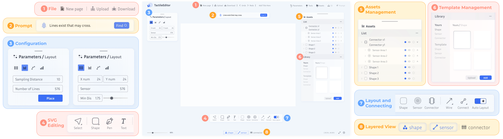

# TacDes: Design Interface toward Ubiquitous Tactile Sensing

### TacDes

TacDes is a web-based toolkit to streamline the design process of resistive tactile sensors for users at various expertise levels. By performing a formative study with experts and non-experts in tactile sensing, we identify motivations and workflows for tactile sensing interface design. With such insights, we create an open-sourced design toolkit, which facilitates the standardized design process with flexible asset management, automated sensor layout generation, ready-to-use templates, safety warning assistance, and layered exports. Future work will extend TacDes to 3D designs and evaluate its impact on fabrication and user experience.

### Publication
Paper Link: https://dl.acm.org/doi/10.1145/3706599.3719721

Bibtex: 
>
    @inproceedings{10.1145/3706599.3719721,
    author = {He, Xinning and Zhang, Shiman and Ma, Luyao and Li, Jingyi and Luo, Yiyue},
    title = {TacDes: Design Interface toward Ubiquitous Tactile Sensing},
    year = {2025},
    isbn = {9798400713958},
    publisher = {Association for Computing Machinery},
    address = {New York, NY, USA},
    url = {https://doi.org/10.1145/3706599.3719721},
    doi = {10.1145/3706599.3719721},
    abstract = {Tactile sensors capture the sensation of touch, providing a unique modality of information for diverse applications in human-computer interaction. However, the complexity and need for customization in tactile sensing interfaces limit their accessibility and potential for broader community. This paper introduces TacDes, a web-based toolkit to streamline the design process of resistive tactile sensors for users at various expertise levels. By performing a formative study with experts and non-experts in tactile sensing, we identify motivations and workflows for tactile sensing interface design. With such insights, we create an open-sourced design toolkit, which facilitates the standardized design process with flexible asset management, automated sensor layout generation, ready-to-use templates, safety warning assistance, and layered exports. Future work will extend TacDes to 3D designs and evaluate its impact on fabrication and user experience.},
    booktitle = {Proceedings of the Extended Abstracts of the CHI Conference on Human Factors in Computing Systems},
    articleno = {500},
    numpages = {8},
    keywords = {tactile sensing, toolkit, interaction design},
    location = {
    },
    series = {CHI EA '25}
    }